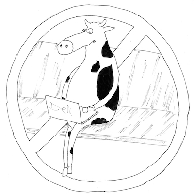

{: .center-image }

Every team has them. "Critical" members on the team who have been around for a long time, have contributed much to the product in the past, and know some portion of the code inside-out. Better than anyone else in the team. So everyone's afraid to step on their toes, lest the sacred cow is disturbed. 

But this causes two problems to the team and the company as whole.

One, since there is no one else to handle the code, the product quality is at risk, should the person decide to leave and go elsewhere. 

Two, if the product has both maintenance and development life-cycles, it is usually impossible for the same person to do both at the same time...and so he or she ends up working on the maintenance end of things most of the time. This leads to a reduction in motivation over time.

## Make the tough call

It is the responsibility of the development/QA manager of the team to tackle the issue. It is *very* hard to be objective about a person's accomplishments over the past 365 days because most humans (and managers, believe it or not, fall under that category) subconsciously put the person's overall reputation before anything else. And if that reputation is daunting, then asking "What, exactly, did you do for the last 3 months, Mr. Superman" can be tough. 

But the manager must make that tough call and determine if a sacred cow phenomenon exists. If it does, it must be addressed immediately. There are no easy fixes; training someone else to become half as proficient as the current specialist is hard. There will be temptations to lean back on the specialist over and over again, at the slightest hint of pressure from customers or other quarters. But falling back to status quo will only make the situation worse. 

Most of the times, the specialist will actually be happy to move to new areas. That is not the problem. The problem is in finding someone else to fill the void. But if you can do it, it is a win-win situation all around. 

For the team. 

For the specialist. 

For the company. 

And of course, for the customer.
